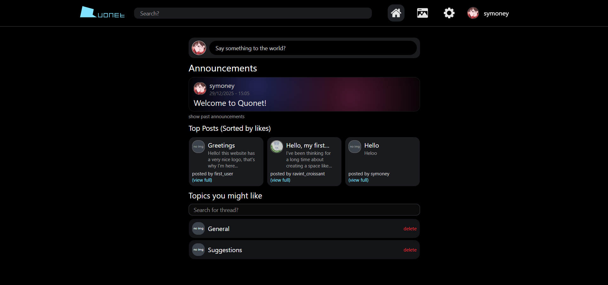

[TYPESCRIPT_BADGE]: https://img.shields.io/badge/typescript-D4FAFF?style=for-the-badge&logo=typescript
[AWS_BADGE]:https://img.shields.io/badge/AWS-%23FF9900.svg?style=for-the-badge&logo=amazon-aws&logoColor=white
[GO_BADGE]:https://img.shields.io/badge/Go-00ADD8?style=for-the-badge&logo=go&logoColor=white
[REDIS_BADGE]:https://img.shields.io/badge/Redis-DC382D?style=for-the-badge&logo=redis&logoColor=white
[POSTGRESQL_BADGE]:https://img.shields.io/badge/PostgreSQL-316192?style=for-the-badge&logo=postgresql&logoColor=white
[SUPABASE_BADGE]:https://img.shields.io/badge/Supabase-3ECF8E?style=for-the-badge&logo=supabase&logoColor=white
[TAILWINDCSS_BADGE]:https://img.shields.io/badge/TailwindCSS-38BDF8?style=for-the-badge&logo=tailwindcss&logoColor=white]
[NEXT_BADGE]:https://img.shields.io/badge/Next.js-000000?style=for-the-badge&logo=nextdotjs&logoColor=white

<h1 align="center" style="font-weight: bold;">Quonet</h1>
<p align="center">
 A forum web application that allows users to create, delete, and like or dislike posts. Users can also update their profile information, including their username and bio. The platform supports content moderation through an admin dashboard.
</p>



<h3 align="center">
    <a href="https://www.quonet.dev"> www.quonet.dev</a>
</h3>

![typescript][TYPESCRIPT_BADGE]
![Go][GO_BADGE]
![AWS][AWS_BADGE]
![Redis][REDIS_BADGE]
![PostgreSQL][POSTGRESQL_BADGE]
![Supabase][SUPABASE_BADGE]
![TailwindCSS][TAILWINDCSS_BADGE]
![Next.js][NEXT_BADGE]

<h2 id="started">📁 Repositories</h2>

 - [Frontend](https://github.com/mxilia/Quonet-frontend)
 - [Backend](https://github.com/mxilia/Quonet-backend)

<h2 id="summary">📄 Summary</h2>

The frontend is built with Next.js following [Bulletproof Architecture](https://github.com/alan2207/bulletproof-react), leveraging server-side rendering for fast initial page loads, TanStack for client-side caching, and Zustand for centralized state management.

Backend is built with Go using Clean Architecture and implements a RESTful API with Fiber v2. PostgreSQL is used for data persistence via GORM, Redis handles rate limiting, and images are stored using Supabase.

<h2 id="tech">💻 Tech Stack</h2>

 - __Frontend:__ Next.js, ShadCN, Tailwind CSS, Zod, TanStack, Zustand
 - __Backend:__ Go, Fiber, GORM, PostgreSQL, Redis
 - __Service:__ AWS, Supabase

<h2 id="started">🚀 Getting started</h2>
<h3 id="prerequisites"> Prerequisites </h3>

 - Node.js (v18 or later)
 - npm

<h3 id="setup"> Setting up </h3>

Run this to clone project:
```bash
git clone https://github.com/mxilia/Quonet-frontend.git
```
After that make sure your current directory is at the root of this project.
```bash
cd Quonet-frontend
```

Run this to download dependencies:
```bash
npm install
```

<h3 id="env">Environment Variables</h2>

Here is the variable list example:
```yaml
DEV=true

NEXT_PUBLIC_API_URL=http://localhost:8000/api/v2
NEXT_PUBLIC_APP_URL=http://localhost:3000
```
Write your own values for corresponding variables.

<h3 id="usage"> Usage </h3>

To run this project, execute:
```bash
npm run dev
```
And there you go, the frontend is up and running.

<h2 id="structure">🧱 Project Structure</h2>

```
.
├── .vscode/
│   └── settings.json
├── assets/
│   └── quonet_page.png
├── public/
│   ├── blue-chat.png
│   ├── comment-icon.png
│   ├── default-avatar.png
│   ├── favicon.ico
│   ├── feeds-icon.png
│   ├── google-logo.png
│   ├── home-icon.png
│   ├── logo.svg
│   └── settings-icon.png
├── src/
│   ├── app/
│   │   ├── layout.tsx
│   │   ├── not-found.tsx
│   │   ├── provider.tsx
│   │   ├── (group)/
│   │   │   ├── layout.tsx
│   │   │   ├── loading.tsx
│   │   │   ├── page.tsx
│   │   │   ├── admin/
│   │   │   │   └── dashboard/
│   │   │   │       └── page.tsx
│   │   │   ├── feed/
│   │   │   │   ├── loading.tsx
│   │   │   │   └── page.tsx
│   │   │   ├── posts/
│   │   │   │   └── [id]/
│   │   │   │       ├── loading.tsx
│   │   │   │       └── page.tsx
│   │   │   ├── settings/
│   │   │   │   └── page.tsx
│   │   │   ├── threads/
│   │   │   │   └── [id]/
│   │   │   │       ├── loading.tsx
│   │   │   │       └── page.tsx
│   │   │   ├── users/
│   │   │   │   └── [id]/
│   │   │   │       ├── loading.tsx
│   │   │   │       └── page.tsx
│   │   │   └── _components/
│   │   │       ├── create-post-tab.tsx
│   │   │       ├── navbar-layout.tsx
│   │   │       └── skeletons/
│   │   │           └── create-post-tab-skeleton.tsx
│   │   └── login/
│   │       ├── layout.tsx
│   │       ├── page.tsx
│   │       └── _components/
│   │           └── redirect-button.tsx
│   ├── assets/
│   ├── components/
│   │   ├── errors/
│   │   │   └── main.tsx
│   │   ├── layouts/
│   │   └── ui/
│   │       ├── background/
│   │       │   └── blur-background.tsx
│   │       ├── dropdown/
│   │       │   └── dropdown-menu.tsx
│   │       ├── form/
│   │       │   ├── error.tsx
│   │       │   ├── field-wrapper.tsx
│   │       │   ├── form.tsx
│   │       │   ├── input.tsx
│   │       │   ├── label.tsx
│   │       │   ├── select.tsx
│   │       │   └── textarea.tsx
│   │       ├── image-frame/
│   │       │   └── image-frame.tsx
│   │       ├── notification/
│   │       │   ├── notification.store.ts
│   │       │   └── notification.tsx
│   │       └── skeleton/
│   │           └── skeleton.tsx
│   ├── config/
│   │   ├── env.ts
│   │   └── path.ts
│   ├── features/
│   │   ├── announcements/
│   │   │   ├── api/
│   │   │   │   ├── create-announcement.ts
│   │   │   │   ├── delete-announcement.ts
│   │   │   │   └── get-announcements.ts
│   │   │   └── components/
│   │   │       ├── announcement-box.tsx
│   │   │       ├── announcements-list.tsx
│   │   │       ├── create-announcement.tsx
│   │   │       └── skeletons/
│   │   │           ├── announcement-box-skeleton.tsx
│   │   │           └── announcements-list-skeleton.tsx
│   │   ├── comments/
│   │   │   ├── api/
│   │   │   │   ├── create-comment.ts
│   │   │   │   ├── delete-comment.ts
│   │   │   │   ├── get-comment.ts
│   │   │   │   ├── get-comments.ts
│   │   │   │   └── update-comment.ts
│   │   │   └── components/
│   │   │       ├── comments-list.tsx
│   │   │       ├── comments.tsx
│   │   │       ├── create-comment.tsx
│   │   │       ├── delete-comment.tsx
│   │   │       └── update-comment.tsx
│   │   ├── likes/
│   │   │   ├── api/
│   │   │   │   ├── create-like.ts
│   │   │   │   ├── delete-like.ts
│   │   │   │   ├── get-like.ts
│   │   │   │   ├── get-like-count.ts
│   │   │   │   ├── get-like-state.ts
│   │   │   │   └── get-likes.ts
│   │   │   └── components/
│   │   │       ├── like-button.tsx
│   │   │       ├── like-counter.tsx
│   │   │       ├── like-modify.tsx
│   │   │       ├── likes-list.tsx
│   │   │       └── likes.tsx
│   │   ├── posts/
│   │   │   ├── api/
│   │   │   │   ├── create-post.ts
│   │   │   │   ├── delete-post.ts
│   │   │   │   ├── get-post.ts
│   │   │   │   ├── get-posts.ts
│   │   │   │   ├── get-private-post.ts
│   │   │   │   ├── get-private-posts.ts
│   │   │   │   ├── get-top-liked-posts.ts
│   │   │   │   └── update-post.ts
│   │   │   └── components/
│   │   │       ├── configure-post.tsx
│   │   │       ├── create-post.tsx
│   │   │       ├── delete-post.tsx
│   │   │       ├── full-post.tsx
│   │   │       ├── medium-post.tsx
│   │   │       ├── posts-list.tsx
│   │   │       ├── private-posts.tsx
│   │   │       ├── private-posts-list.tsx
│   │   │       ├── small-post.tsx
│   │   │       ├── top-liked-post-list.tsx
│   │   │       ├── update-post.tsx
│   │   │       └── skeletons/
│   │   │           ├── full-post-skeleton.tsx
│   │   │           ├── medium-post-skeleton.tsx
│   │   │           ├── posts-list-skeleton.tsx
│   │   │           ├── small-post-skeleton.tsx
│   │   │           └── top-liked-posts-list-skeleton.tsx
│   │   ├── threads/
│   │   │   ├── api/
│   │   │   │   ├── create-thread.ts
│   │   │   │   ├── delete-thread.ts
│   │   │   │   ├── get-thread.ts
│   │   │   │   └── get-threads.ts
│   │   │   └── components/
│   │   │       ├── create-thread.tsx
│   │   │       ├── delete-thread.tsx
│   │   │       ├── full-thread.tsx
│   │   │       ├── select-thread.tsx
│   │   │       ├── small-thread.tsx
│   │   │       ├── threads.tsx
│   │   │       ├── threads-list.tsx
│   │   │       └── skeletons/
│   │   │           ├── full-thread-skeleton.tsx
│   │   │           ├── small-thread-skeleton.tsx
│   │   │           └── threads-list-skeleton.tsx
│   │   └── users/
│   │       ├── api/
│   │       │   ├── delete-user.ts
│   │       │   ├── get-user.ts
│   │       │   ├── get-users.ts
│   │       │   └── update-user.ts
│   │       └── components/
│   │           ├── admin-users-list.tsx
│   │           ├── delete-user.tsx
│   │           ├── full-user.tsx
│   │           ├── small-user.tsx
│   │           ├── update-user-bio.tsx
│   │           ├── update-user-handler.tsx
│   │           ├── update-user-role.tsx
│   │           └── skeletons/
│   │               ├── full-user-skeleton.tsx
│   │               ├── small-user-skeleton.tsx
│   │               └── users-list-skeleton.tsx
│   ├── lib/
│   │   ├── api-client.ts
│   │   ├── auth.ts
│   │   ├── authorization.ts
│   │   ├── react-query.ts
│   │   ├── redirect-client.ts
│   │   └── utils.ts
│   ├── styles/
│   │   └── globals.css
│   ├── types/
│   │   └── api.ts
│   └── utils/
│       ├── debounce.ts
│       └── format.ts
├── .env
├── .env.example
├── .env.production
├── .gitignore
├── .prettierignore
├── .prettierrc
├── components.json
├── eslint.config.mjs
├── LICENSE
├── next-env.d.ts
├── next.config.ts
├── package-lock.json
├── package.json
├── postcss.config.mjs
├── README.md
└── tsconfig.json
```
